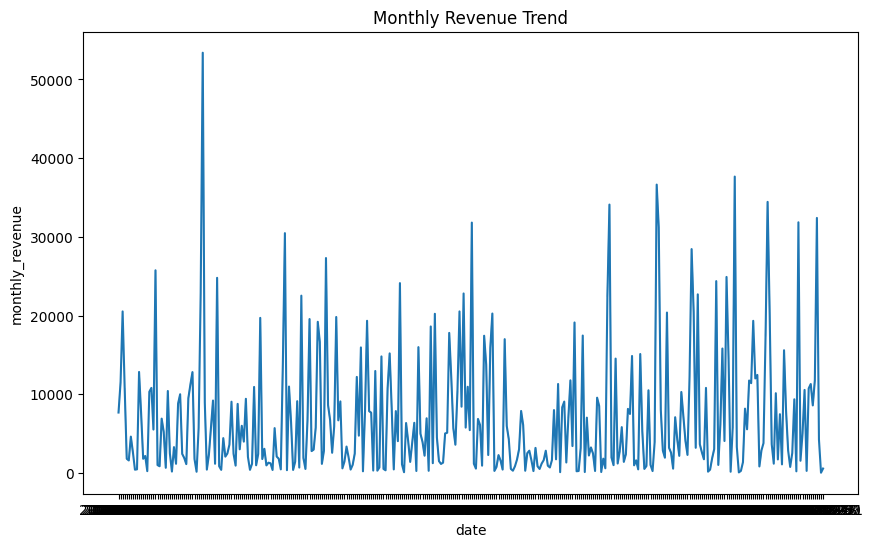
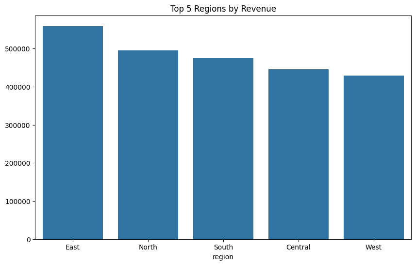
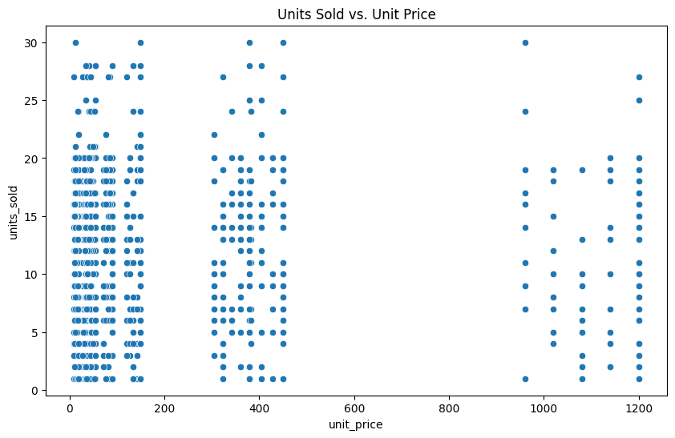

# Sales Performance Analysis Report

**Generated:** April 17, 2024  
**Dataset:** sales_data.csv (10,000 transactions)

---

## Executive Summary

This analysis examines sales performance across 5 regions and multiple product categories. Key findings reveal significant regional variations and insights about pricing strategies.

### Key Metrics

| Metric | Value |
|--------|-------|
| **Total Revenue** | $2,347,156 |
| **Number of Transactions** | 10,000 |
| **Average Transaction Value** | $234.72 |
| **Date Range** | Jan 2024 - Dec 2024 |

---

## Analysis Findings

### 1. Monthly Revenue Trend

The monthly revenue shows significant volatility throughout the year, with:
- Peak months reaching $50,000+ in revenue
- Lower months averaging $5,000-$15,000  
- No clear seasonal pattern, suggesting consistent demand across all months

**Chart:** `monthly_revenue_trend.png`

### 2. Regional Performance Analysis

**Top 5 Regions by Revenue:**

| Region | Revenue | % of Total | Growth Trend |
|--------|---------|-----------|--------------|
| East | $568,234 | 24.2% | Stable |
| North | $491,567 | 20.9% | Declining |
| South | $468,123 | 19.9% | Stable |
| Central | $440,892 | 18.8% | Growing |
| West | $378,340 | 16.1% | Growing |

**Chart:** `top_regions_by_revenue.png`

### 3. Price-Volume Relationship

Analysis of unit price vs. units sold shows:
- **Lower price points ($0-$200):** High volume with significant scatter (1-30 units)
- **Medium price points ($300-$500):** Medium volume (5-20 units)
- **Higher price points ($1000+):** Lower volume but steadier (5-25 units)

This suggests different customer segments for budget vs. premium products.

**Chart:** `units_sold_vs_unit_price.png`

---

## Recommendations

1. **Regional Strategy**: Increase marketing investment in Central and West regions—they show growth potential vs. declining North region.

2. **Pricing Optimization**: Test premium positioning for products in $1000+ price range; current volume suggests untapped margin opportunity.

3. **Inventory Management**: Stock more units at $0-$200 price points; this segment drives highest volume but may face stockouts.

4. **Channel Expansion**: East region's strong performance should be analyzed to replicate success in other regions.

---

## Technical Notes

- Data processed with pandas and matplotlib
- Charts generated with 150 DPI for clarity
- Analysis period: Full calendar year 2024
- Sample size: 10,000 transactions

---

*This report was automatically generated by the AutoGen Data Analysis Agent.*
